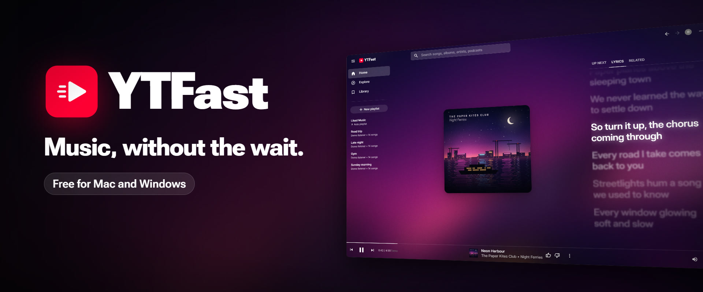
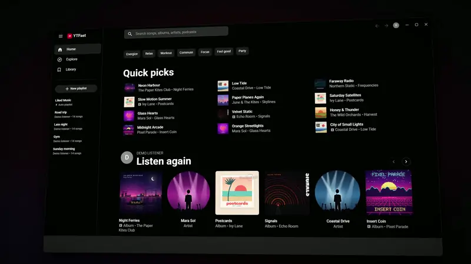
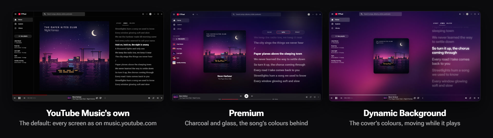

<p align="center">
  
</p>

<p align="center">
  <b>YouTube Music, native and fast.</b><br>
  Your Home, Library, playlists and lyrics, in a small app that starts songs almost the moment you ask.
</p>

<p align="center">
  <a href="https://github.com/Likheet/YTFast/releases/latest"></a>
  
  
</p>

On a computer, YouTube Music is a web page. **YTFast** (YouTube Music Fast) is
the same YouTube Music as a native app, built in the spirit of
[Spotifast](https://github.com/crmne/spotifast): every screen laid out as
YouTube Music lays it out, without the browser underneath. It is free, for
YouTube Music **Premium** accounts, on **Mac (Apple Silicon)** and **Windows**.

<p align="center">
  
</p>

## Why it feels fast

- **Ready before you click.** Rest the pointer on a song for a moment and
  YTFast finds it ahead, so a click starts it almost at once. The top
  search result is found ahead too.
- **Plays while it downloads.** A song starts from its first moments while
  the rest arrives, and the next song is made ready while this one plays.
- **No web page inside.** YTFast is its own program, written in Rust. It
  opens quickly, scrolls smoothly, and keeps playing while minimised.
- **Light.** Paused, it uses **0% of the processor**, and it is built to
  stay under 200 MB of memory (about 120 MB, measured with the demo).

## Everything you know from YouTube Music

- **Home, Explore and your Library**, with your playlists, albums, artists
  and songs, measured one to one against music.youtube.com.
- **Search as you type**, with suggestions, pictures, past searches and
  YouTube Music's own filters.
- **The player page**: the cover beside **Up next** (drag songs into any
  order), **lyrics that follow the song** line by line, and **Related**.
- **Your account, live**: likes, playlists, saves and subscriptions go
  straight to YouTube Music, and every song you play reaches your History,
  so your recommendations keep learning.
- **YouTube Music's keyboard shortcuts** (press `?` to see them), your
  keyboard's media keys, and the computer's own media controls.
- **Updates itself**: new versions download in the background and install
  when you restart.

## Three looks

<p align="center">
  
</p>

Choose in **Settings**: **YouTube Music's own** look (the default),
**Premium** (charcoal and glass, with the playing song's colours behind
it), or **Dynamic Background** (the cover's colours, moving while it
plays, with large lyrics).

## Get it

1. **Sign in** to [music.youtube.com](https://music.youtube.com) in your
   browser with your Premium account. On **Windows**, use **Firefox**
   (Chrome, Edge and Brave lock their sign-in away from other programs).
   On a **Mac**, Chrome, Firefox, Edge, Brave or Safari.
2. **Download** from the [newest release](https://github.com/Likheet/YTFast/releases/latest):
   **YTFast.exe** for Windows (64-bit) or **YTFast.dmg** for a Mac with
   Apple Silicon (M1 or newer).
3. **Open it** and choose that browser. The first time, YTFast downloads
   two helpers (yt-dlp and Deno, about 250 MB) and gets ready in a minute
   or two. After that it signs in by itself.

YTFast is not signed with a paid certificate, so Windows says "Windows
protected your PC" (click **More info**, then **Run anyway**) and a Mac asks
you to allow it once in **System Settings**, **Privacy & Security**. The
full guide, with every step and what to do if something goes wrong:
**[How to run YTFast](docs/run-the-app.md)**.

Want to look around first? Start it with `--demo` for made-up music, with
no account and no sign-in.

YTFast is young and changes often. It is used every day on Windows; the
Mac build comes from the same code but has been tried less.

## Your account and your data

- YTFast reads **only YouTube's** sign-in from your browser; every other
  site's is dropped the moment it is read. The copy stays on your computer
  in a private folder, is deleted when YTFast closes, and is only ever sent
  to YouTube.
- Songs are found the way the website finds them, and sometimes through
  [yt-dlp](https://github.com/yt-dlp/yt-dlp). yt-dlp's makers warn that an
  account used with it can be banned. YTFast only asks for what a listener
  does (the song playing and the next few), never bulk downloads, but the
  risk is not zero.
- Never paste your browser's cookies or a `cookies.txt` file into any chat.

## How it works

- **Your sign-in** comes from your web browser, and is read again by itself
  whenever YouTube stops accepting the copy YTFast has.
- **Your music** (Home, Library, search) comes from the same internal API
  music.youtube.com uses. There is no official YouTube Music API.
- **The audio** of each song is found the way the website finds it, with
  yt-dlp's challenge solver kept running in Deno, and plays while it
  downloads. If that fails, yt-dlp itself finds the song. YTFast downloads
  yt-dlp and Deno and checks both against their published fingerprints.
- **Lyrics** come from YouTube Music, or from [LRCLIB](https://lrclib.net)
  (a free lyrics database) when YouTube Music has none that follow the song.
- **Playing** happens in YTFast itself, through the same audio code as
  Spotifast: it follows your headphones and uses no processor while paused.

## For developers and AI assistants

Start with [AGENTS.md](AGENTS.md): what YTFast is, how the code is laid out,
its rules, and what has been tested. Build and test:

```sh
cargo test --workspace
cargo run -p ytfast              # the app
cargo run -p ytfast -- --demo    # the app with made-up music, no account
cargo run -p ytfast-check        # the step 0 check
```

Linux needs `libasound2-dev` for the audio library. The plan and its risks:
[docs/plan.md](docs/plan.md). Making a release:
[docs/releasing.md](docs/releasing.md).

## Credits

YTFast builds on [fastframe](https://github.com/crmne/fastframe) and learns
from [Spotifast](https://github.com/crmne/spotifast) (both MIT, by Carmine
Paolino), [ytmusicapi](https://github.com/sigma67/ytmusicapi) (MIT),
[Kaset](https://github.com/sozercan/kaset) (MIT) and
[yt-dlp](https://github.com/yt-dlp/yt-dlp) (Unlicense). Its lyrics follow
the style of [Better Lyrics](https://betterlyrics.org)' Even Better Lyrics
Plus theme (recreated without its code), and its Dynamic Background look
recreates chengggit's
[Dynamic Background](https://github.com/chengggit/YouTube-Music-Dynamic-Theme)
theme for Better Lyrics (MIT). Lyrics come partly from
[LRCLIB](https://lrclib.net). Icons are Google's
[Material Symbols](https://fonts.google.com/icons) (Apache 2.0) and
[Lucide](https://lucide.dev) (ISC); the fonts are
[Roboto](https://github.com/googlefonts/roboto-classic) and
[Inter](https://github.com/rsms/inter) (SIL Open Font License). Their
licence texts, and those of the Rust libraries YTFast is built from, are in
[THIRD-PARTY-NOTICES.txt](THIRD-PARTY-NOTICES.txt), which comes with every
download.

YTFast is an independent project, not affiliated with YouTube or Google.
YouTube and YouTube Music are trademarks of Google LLC. Using unofficial
apps is against YouTube's terms of service; see the risks in
[docs/plan.md](docs/plan.md).
